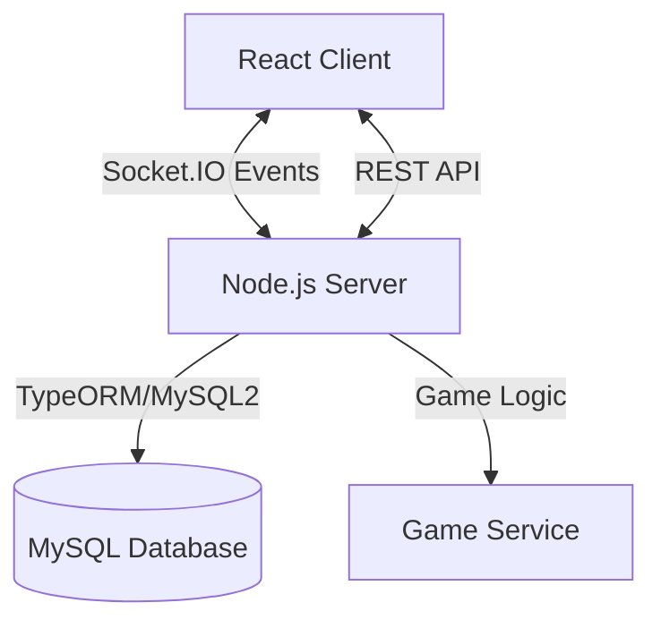

# 🧩 Match-3 Multiplayer

Un juego multijugador en tiempo real tipo Match-3, construido con **React**, **Node.js**, **Socket.IO** y **MySQL**.


## 🚀 Getting Started

### Prerrequisitos

- Node.js (v18+)
- Docker & Docker Compose (Opcional, para base de datos)
- MySQL (si no usas Docker)

### Instalación Rápida

1. **Clonar el repositorio**

   ```bash
   git clone <repo-url>
   cd Match-3
   ```

2. **Iniciar Base de Datos (Docker)**

   ```bash
   cd programa
   docker-compose up -d db
   ```

3. **Instalar Dependencias**

   ```bash
   # Servidor
   cd programa/server
   npm install

   # Cliente
   cd ../client
   npm install
   ```

4. **Ejecutar en Desarrollo**
   - **Servidor**: `npm run dev` (Puerto 4000)
   - **Cliente**: `npm start` (Puerto 3000)

## 🏗️ Arquitectura

El proyecto sigue una arquitectura cliente-servidor desacoplada.



### Tecnologías Clave

- **Frontend**: React, TypeScript, React Router, Socket.IO Client.
- **Backend**: Express, Socket.IO, TypeScript.
- **Base de Datos**: MySQL.
- **Comunicación**: Híbrida (REST para auth/inicio, WebSockets para juego en tiempo real).

## 📚 API Summary

### REST Endpoints

- `POST /api/partida/crear_partida`: Crea una nueva sala.
- `GET /api/partida/partidas`: Lista salas disponibles.
- `GET /api/partida/ranking`: Top jugadores.

### Socket Events

- `join_game`: Unirse a una sala.
- `make_move`: Realizar un movimiento (swap).
- `board_update`: Recibir estado del tablero.

## 🧪 Testing

```bash
# Servidor
cd programa/server
npm test

# Cliente
cd programa/client
npm test
```
