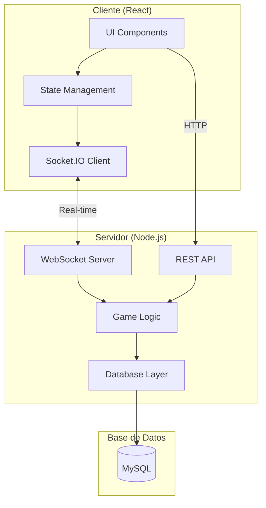

# 🧩 Match-3 Multiplayer Game

<div align="center">


**Un juego multijugador en tiempo real tipo Match-3 con arquitectura profesional**

[](https://www.typescriptlang.org/)
[](https://reactjs.org/)
[](https://nodejs.org/)
[](https://socket.io/)
[](https://www.mysql.com/)
[](./LICENSE)

[Demo](#) · [Documentación](#) · [Reportar Bug](https://github.com/usuario/Match-3/issues)

</div>

---

## 📋 Tabla de Contenidos

- [Características](#-características)
- [Demo](#-demo)
- [Arquitectura](#️-arquitectura)
- [Instalación](#-instalación)
- [Uso](#-uso)
- [API](#-api)
- [Tecnologías](#-tecnologías)
- [Desarrollo](#-desarrollo)
- [Testing](#-testing)
- [Deployment](#-deployment)
- [Contribuir](#-contribuir)
- [Licencia](#-licencia)

---

## ✨ Características

### 🎮 Gameplay

- ✅ **Multijugador en tiempo real** - Hasta 4 jugadores simultáneos
- ✅ **Sistema de puntuación** - Rankings y leaderboards
- ✅ **Múltiples temáticas** - Gemas, frutas, y más
- ✅ **Matchmaking inteligente** - Salas públicas y privadas
- ✅ **Sincronización perfecta** - WebSockets para latencia mínima

### 🎨 UI/UX

- ✅ **Diseño moderno** - Glassmorphism y animaciones fluidas
- ✅ **Responsive** - Funciona en desktop, tablet y móvil
- ✅ **Accesibilidad** - ARIA labels y navegación por teclado
- ✅ **Feedback visual** - Animaciones, notificaciones y efectos

### 🏗️ Técnicas

- ✅ **Clean Architecture** - Separación de responsabilidades
- ✅ **TypeScript** - Type-safe en cliente y servidor
- ✅ **Real-time sync** - Socket.IO para comunicación bidireccional
- ✅ **Database persistence** - MySQL con pooling de conexiones
- ✅ **Docker ready** - Containerización completa

---

## 🎬 Demo

### Screenshots

<div align="center">

| Lobby | Gameplay | Results |
|-------|----------|---------|
|  |  |  |

</div>

### Video Demo

[](https://youtube.com/demo)

---

## 🏗️ Arquitectura



### Estructura del Proyecto

```
Match-3/
├── programa/
│   ├── client/                 # React Frontend
│   │   ├── src/
│   │   │   ├── components/     # Componentes reutilizables
│   │   │   ├── views/          # Páginas/Vistas
│   │   │   ├── hooks/          # Custom React hooks
│   │   │   ├── services/       # Socket.IO service
│   │   │   ├── context/        # React Context (Auth)
│   │   │   └── styles/         # CSS modules
│   │   └── public/             # Assets estáticos
│   │
│   ├── server/                 # Node.js Backend
│   │   ├── src/
│   │   │   ├── api/            # REST endpoints
│   │   │   ├── sockets/        # Socket.IO handlers
│   │   │   ├── core/           # Lógica de negocio
│   │   │   │   ├── domain/     # Entidades del dominio
│   │   │   │   ├── services/   # Servicios de juego
│   │   │   │   ├── repositories/ # Acceso a datos
│   │   │   │   └── workers/    # Workers para procesamiento
│   │   │   ├── config/         # Configuración
│   │   │   └── types/          # TypeScript types
│   │   └── tests/              # Tests
│   │
│   └── docker-compose.yml      # Orquestación Docker
│
└── documentacion/              # Documentación adicional
```

---

## 🚀 Instalación

### Prerrequisitos

- **Node.js** >= 18.0.0
- **npm** >= 9.0.0
- **MySQL** >= 8.0 (o Docker)
- **Git**

### Instalación Rápida

```bash
# 1. Clonar repositorio
git clone https://github.com/usuario/Match-3.git
cd Match-3/programa

# 2. Iniciar base de datos (Docker)
docker-compose up -d db

# 3. Instalar dependencias
cd server && npm install
cd ../client && npm install

# 4. Configurar variables de entorno
cp server/.env.example server/.env
cp client/.env.example client/.env

# 5. Iniciar servicios
# Terminal 1 - Servidor
cd server && npm run dev

# Terminal 2 - Cliente
cd client && npm start
```

### Variables de Entorno

#### Servidor (`server/.env`)

```env
PORT=4000
LOG_LEVEL=info

# Database
DB_HOST=localhost
DB_USER=root
DB_PASSWORD=your_password
DB_DATABASE=matchdb
```

#### Cliente (`client/.env`)

```env
# Opcional: URL de ngrok para desarrollo remoto
REACT_APP_NGROK_URL=
```

---

## 💻 Uso

### Desarrollo Local

```bash
# Servidor (Puerto 4000)
cd programa/server
npm run dev

# Cliente (Puerto 3000)
cd programa/client
npm start
```

Abre [http://localhost:3000](http://localhost:3000) en tu navegador.

### Producción

```bash
# Build
npm run build

# Start
npm start
```

---

## 📡 API

### REST Endpoints

#### Jugadores

```http
POST /api/jugador/registrar
Body: { "nickname": "string" }
Response: { "id": number, "nickname": "string" }
```

#### Partidas

```http
POST /api/partida/crear_partida
Body: { 
  "hostId": number,
  "tematica": "Gemas" | "Frutas",
  "maxJugadores": number,
  "tiempoLimite": number
}

GET /api/partida/partidas
Response: Array<Partida>

GET /api/partida/ranking
Response: Array<{ nickname, puntaje, partidasJugadas }>
```

### Socket Events

#### Cliente → Servidor

- `join_game` - Unirse a una partida
- `start_game` - Iniciar partida (solo host)
- `select_cell` - Seleccionar celda
- `activate_match` - Activar match
- `leave_game` - Abandonar partida

#### Servidor → Cliente

- `game_state` - Estado completo del juego
- `board_update` - Actualización del tablero
- `player_joined` - Jugador se unió
- `player_left` - Jugador abandonó
- `match_result` - Resultado de match
- `game_finished` - Partida finalizada

---

## 🛠️ Tecnologías

### Frontend

- **React 19** - UI library
- **TypeScript** - Type safety
- **React Router** - Routing
- **Socket.IO Client** - Real-time communication
- **Axios** - HTTP client

### Backend

- **Node.js** - Runtime
- **Express** - Web framework
- **Socket.IO** - WebSocket server
- **MySQL2** - Database driver
- **Winston** - Logging
- **Helmet** - Security headers

### DevOps

- **Docker** - Containerization
- **Docker Compose** - Orchestration
- **ESLint** - Linting
- **Prettier** - Code formatting

---

## 👨‍💻 Desarrollo

### Scripts Disponibles

#### Cliente

```bash
npm start          # Desarrollo
npm run build      # Build producción
npm test           # Tests
npm run lint       # Linting
```

#### Servidor

```bash
npm run dev        # Desarrollo con hot-reload
npm run build      # Compilar TypeScript
npm start          # Producción
npm test           # Tests
npm run lint       # Linting
npm run format     # Formatear código
```

### Convenciones de Código

- **TypeScript strict mode** habilitado
- **ESLint** para linting
- **Prettier** para formateo
- **Conventional Commits** para mensajes de commit

---

## 🧪 Testing

```bash
# Unit tests
npm test

# Coverage
npm run test:coverage

# Watch mode
npm run test:watch
```

---

## 🚀 Deployment

### Docker

```bash
# Build images
docker-compose build

# Start services
docker-compose up -d

# View logs
docker-compose logs -f
```

### Manual

Ver [DEPLOYMENT.md](./DEPLOYMENT.md) para instrucciones detalladas.

---

## 🤝 Contribuir

¡Las contribuciones son bienvenidas!

1. Fork el proyecto
2. Crea tu feature branch (`git checkout -b feature/AmazingFeature`)
3. Commit tus cambios (`git commit -m 'Add some AmazingFeature'`)
4. Push al branch (`git push origin feature/AmazingFeature`)
5. Abre un Pull Request

Ver [CONTRIBUTING.md](./CONTRIBUTING.md) para más detalles.

---

## 📄 Licencia

Este proyecto está bajo la Licencia MIT. Ver [LICENSE](./LICENSE) para más información.

---

## 👥 Autores

- **Tu Nombre** - *Desarrollo inicial* - [@usuario](https://github.com/usuario)

---

## 🙏 Agradecimientos

- Inspirado en juegos clásicos de Match-3
- Comunidad de React y Node.js
- Todos los contribuidores

---

<div align="center">

**⭐ Si te gusta este proyecto, dale una estrella en GitHub! ⭐**

</div>
