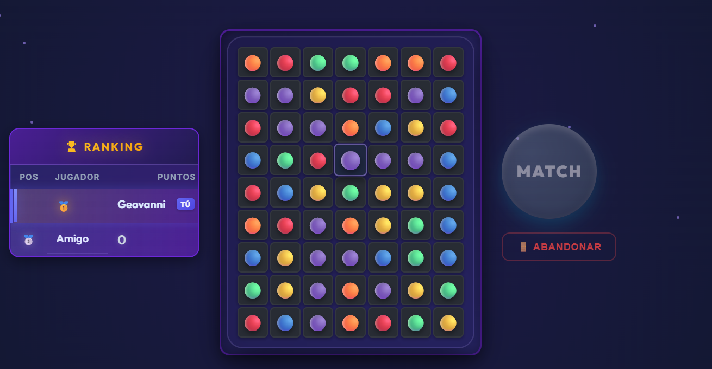

# Match-3 Multiplayer

[](https://github.com/Geovanni-Gonzalez/Match-3/actions/workflows/ci.yml)

## Descripción
Juego Match-3 multijugador en tiempo real con TypeScript, cliente React, servidor Node/Socket.IO y persistencia preparada para MySQL.

## Objetivo
Construir un juego competitivo con estado compartido, validación en servidor y tipos compartidos.

## Tecnologías utilizadas
- TypeScript
- React
- Node.js
- Express
- Socket.IO
- MySQL
- Docker
- Jest

## Funcionalidades principales
- Partidas en tiempo real
- Lobby y eventos
- Tipos compartidos
- API de jugadores/partidas
- Pruebas core

## Mi rol
Desarrollé arquitectura por paquetes, componentes cliente, servidor de sockets/API y validación.

## Aprendizajes clave
- Estructura multipaquete
- Sincronización de estado
- Server-side validation
- Jest
- Docker

## Instalación y ejecución
Instalar dependencias del workspace:
```bash
cd Match-3/programa
npm install
```
Ejecutar servidor y cliente en terminales separadas:
```bash
npm run dev:server
npm run start:client
```
Alternativa con Docker, si el entorno tiene Docker disponible:
```bash
docker compose up --build
```

## Estructura del proyecto
- programa/server/: API/sockets/pruebas
- programa/client/: React
- programa/shared/: tipos
- docker-compose.yml: servicios

## Capturas o demo


## Estado del proyecto
Proyecto académico avanzado en desarrollo.

## Valor técnico demostrado
Muestra arquitectura full stack en tiempo real, TypeScript compartido y pruebas.

## Mejoras futuras
- Documentar variables de entorno
- Documentar variables
- Publicar capturas reales

## Autor
Geovanni González  
Estudiante de Ingeniería en Computación  
GitHub: [Geovanni-Gonzalez](https://github.com/Geovanni-Gonzalez)


